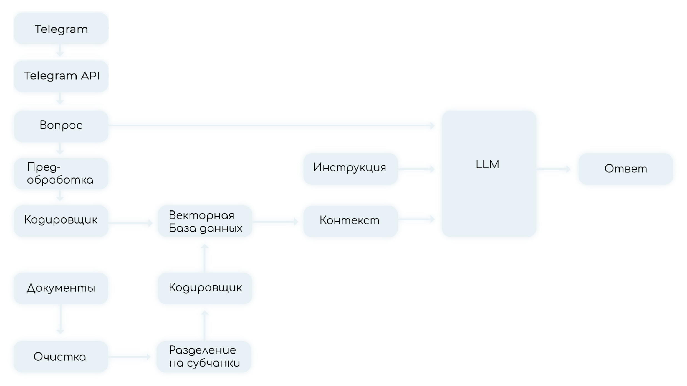

<p align="center">
  
</p>

# Веб-сервис HackAssist

## Обзор

HackAssist — это прототип веб-сервиса, разработанный для облегчения работы участников и организаторов хакатонов. Проект решает проблемы интеграции и анализа различных данных, предоставляя единую платформу для доступа к данным, их обработки и аналитики.

## Структура проекта

``` structure
HackAssist
│
├── backend
│   ├── .chart
│   ├── .docker
│   ├── models
│   │   ├── __init__.py
│   │   ├── article.py
│   │   └── database.py
│   ├── routers
│   │   ├── __init__.py
│   │   └── upload.py
│   ├── utils
│   │   ├── __init__.py
│   │   ├── ml.py
│   │   └── utils.py
│   ├── __init__.py
│   ├── alembic.ini
│   ├── app.py
│   ├── docker-compose.local.yml
│   ├── Dockerfile
│   ├── Makefile
│   ├── poetry.lock
│   ├── pyproject.toml
│   ├── README.md
│   ├── SETTINGS.py
│   ├── utilities.py
│   └── data
│
├── assistant
│   ├── .dockerignore
│   ├── .env
│   ├── .gitignore
│   ├── .pre-commit-config.yaml
│   ├── docker-compose.yml
│   ├── LICENSE
│   ├── poetry.lock
│   ├── pyproject.toml
│   └── requirements.txt
│
├── clickhouse
│   ├── .dockerignore
│   ├── .gitignore
│   ├── docker-compose.yml
│   └── requirements.txt
```

## Преимущества проекта

- **Единая платформа**: Объединяет различные данные о хакатонах, облегчая интеграцию информации.
- **Оперативный анализ данных**: Предоставляет инструменты для быстрого доступа и анализа данных о хакатонах.
- **Автоматизация процессов**: Минимизирует ручной ввод данных, снижая вероятность ошибок.
- **Аналитические возможности**: Обеспечивает доступ к аналитической информации в удобном виде, интеграция с современными веб-сервисами и системами обмена сообщениями.

## Инструкция по запуску

### 1. Скачивание языковой модели

Скачайте языковую модель с помощью команды:

```bash
wget https://huggingface.co/IlyaGusev/saiga_mistral_7b_gguf/resolve/main/model-q8_0.gguf
```

### 2. Подготовка окружения

#### Создание файлов среды

1. Создайте файл среды `.env` в директории `assistant/` и заполните его необходимыми переменными окружения, включая `TG_TOKEN`.
2. Создайте еще один файл `.env` в директорию `backend/configs/` для настройки бэкенда.

#### Выпуск сертификатов для Nginx

Для безопасной работы веб-сервера выпустите SSL-сертификаты для Nginx. Если предпочтительнее работать без Nginx, удалите его из файла `docker-compose.yml`.

#### Настройка портов

В файле `docker-compose.yml` настройте публикацию портов, чтобы обеспечить доступ к сервисам извне. Убедитесь, что порты не конфликтуют с уже используемыми на вашем сервере.

### 3. Запуск приложения

Используйте команду ниже для запуска всех компонентов системы:

```bash
docker-compose up
```

### 4. Настройка и запуск Telegram-бота

Создайте файл `.env` в директории `assistant/` и добавьте в него переменную `TG_TOKEN`, содержащую ваш токен Telegram-бота:

```plaintext
TG_TOKEN=your_telegram_token_here
```

## Используемые технологии

- **Backend**: FastAPI, SQLAlchemy, PostgreSQL, Docker
- **Модели и аналитика**: Использование языковой модели, интеграция с Hugging Face и LLama-cpp python интерфейса.
- **LLM**: Сайга Mistral квантизированная под q8. Разработана русским разработчиком.

## Заключение

HackAssist — это инновационный проект, направленный на решение актуальных проблем в области проведения хакатонов. Благодаря ему пользователи смогут легко интегрировать, обрабатывать и анализировать данные, получая при этом доступ к передовым аналитическим инструментам. Давайте вместе сделаем шаг в будущее цифровых технологий и автоматизации в проведении хакатонов!
